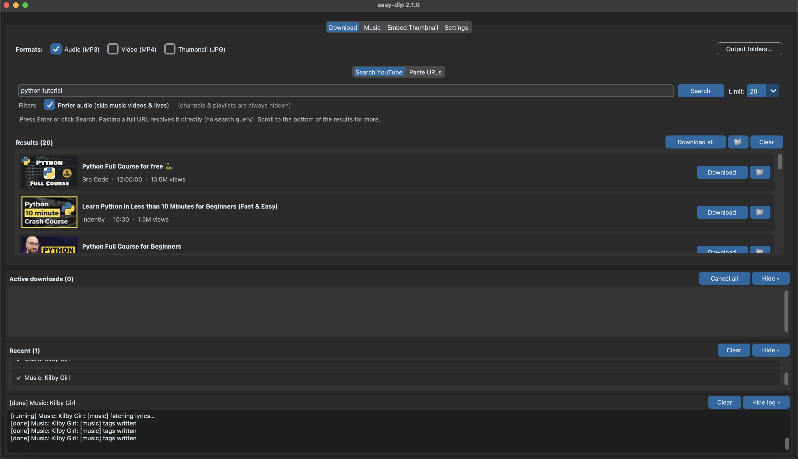
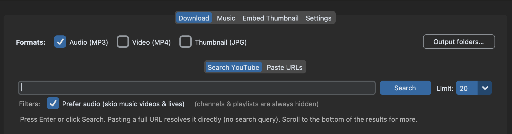
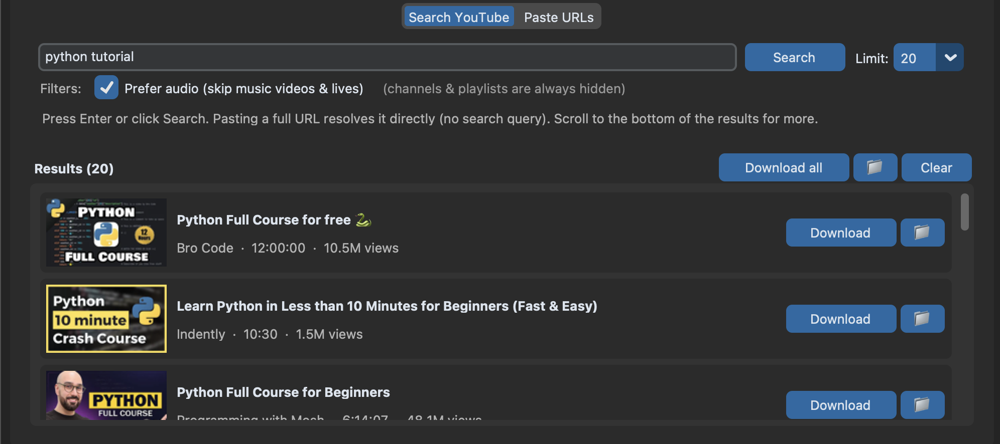
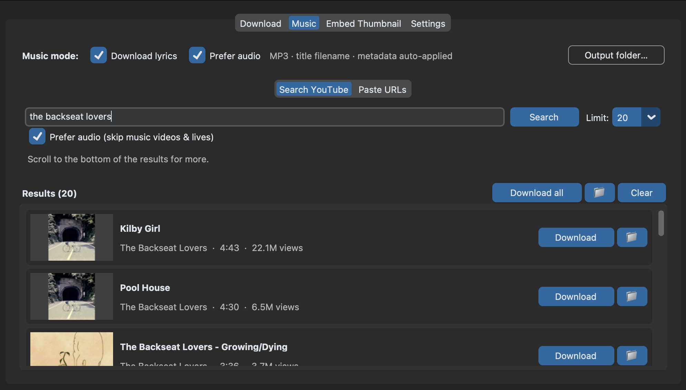
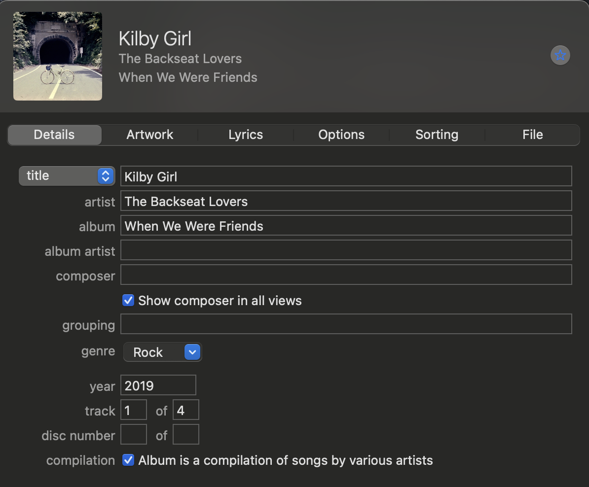
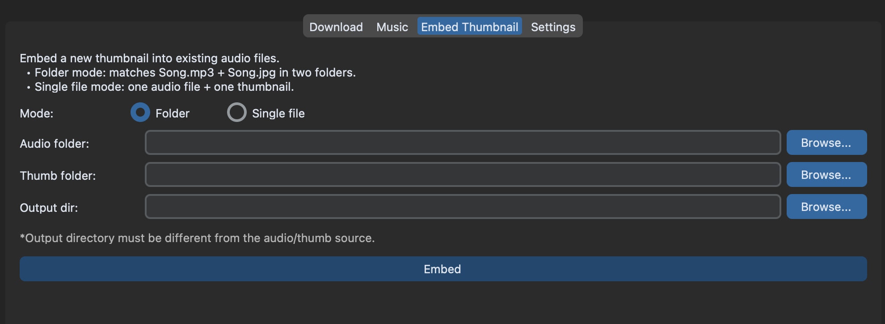
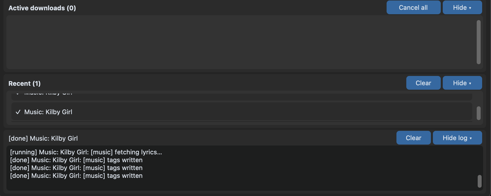
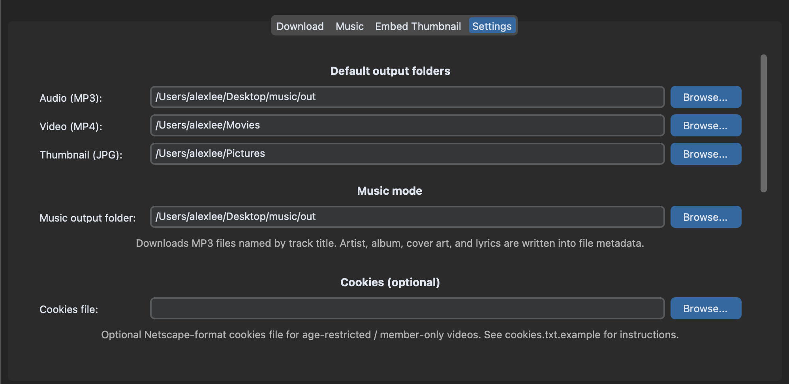

<div align="center">

# easy-dlp

### A modern desktop app for searching, downloading, and tagging music from YouTube and Spotify — no terminal required.

[](https://www.python.org/downloads/)
[](https://github.com/yt-dlp/yt-dlp)
[](#license)

[Installation](#installation) · [Features](#features) · [Quick Start](#quick-start) · [Tech Stack](#tech-stack)

</div>

---

> Solo-built desktop application spanning UI, background job orchestration, metadata pipelines (iTunes API + ID3 tagging), and media post-processing (ffmpeg). Demonstrates threading/concurrency, API integration, persistent settings, and production-minded UX polish. Jump to [Tech Stack](#tech-stack) or [Project Structure](#project-structure).

<br>

<!-- Hero screenshot — drop your image at docs/screenshots/00-hero.png -->
<p align="center">
  
</p>

<p align="center"><em>↑ Screenshot: <code>docs/screenshots/00-hero.png</code> — full app window, light or dark theme</em></p>

<br>

---

## Table of contents

| | |
|---|---|
| **Get started** | [Installation](#installation) · [Quick Start](#quick-start) · [Requirements](#requirements) · [Troubleshooting](#troubleshooting) |
| **Learn the app** | [Features](#features) · [How to Use](#how-to-use) |
| **For developers** | [Tech Stack](#tech-stack) · [Project Structure](#project-structure) · [Manual Install](#manual-install-developers) · [Distributing](#distributing-a-standalone-app) |
| | [License](#license) |

---

<br>

# Installation

> **Start here.** This walkthrough assumes no prior Python experience. Follow each step in order for your operating system.

<br>

## What you'll need

| Requirement | Why you need it |
|:---|:---|
| **Git** | Downloads the project from GitHub |
| **Python 3.10+** with **tkinter** | Runs the app and draws the GUI |
| **ffmpeg** | Converts and muxes audio/video (auto-detected on most systems) |

The included `run.sh` script creates a private Python environment and installs all Python dependencies on first launch.

<br>

## Step 0 — Check for Python

Open a terminal and run:

```bash
python3 --version
```

| Result | Next step |
|:---|:---|
| `Python 3.10` or higher | Continue to [Step 1](#step-1--download-the-project) |
| `command not found` or version below 3.10 | Install Python first (see below) |

<details>
<summary><strong>🍎 macOS — install Python</strong></summary>

<br>

**Option A — Homebrew** *(recommended)*

1. Install [Homebrew](https://brew.sh) if needed.
2. Run:
   ```bash
   brew install python@3.12 python-tk@3.12
   ```
3. Verify:
   ```bash
   python3.12 --version
   python3.12 -c "import tkinter; print('tkinter OK')"
   ```

**Option B — python.org**

1. Download from [python.org/downloads/macos](https://www.python.org/downloads/macos/).
2. Run the installer — leave all default components checked.
3. Open a **new** Terminal and run `python3 --version`.

</details>

<details>
<summary><strong>🪟 Windows — install Python</strong></summary>

<br>

1. Download from [python.org/downloads/windows](https://www.python.org/downloads/windows/).
2. On the first installer screen, **check "Add python.exe to PATH"**.
3. Click **Customize installation** → ensure **tcl/tk and IDLE** is checked.
4. Finish, then verify in Command Prompt:
   ```bat
   python --version
   python -c "import tkinter; print('tkinter OK')"
   ```

</details>

<details>
<summary><strong>🐧 Linux (Debian/Ubuntu) — install Python</strong></summary>

<br>

```bash
sudo apt update
sudo apt install python3 python3-venv python3-tk
python3 --version
python3 -c "import tkinter; print('tkinter OK')"
```

</details>

<br>

## Step 1 — Download the project

**Git clone** *(recommended)*

```bash
git clone https://github.com/abl241/easy-dlp.git
cd easy-dlp
```

**Or download ZIP**

1. On GitHub → **Code** → **Download ZIP**
2. Unzip the archive
3. Open a terminal inside the folder

<br>

## Step 2 — Install ffmpeg

<details>
<summary><strong>🍎 macOS</strong></summary>

```bash
brew install ffmpeg
```

</details>

<details>
<summary><strong>🪟 Windows</strong></summary>

1. Download from [gyan.dev/ffmpeg/builds](https://www.gyan.dev/ffmpeg/builds/) (*ffmpeg-release-essentials*).
2. Add the `bin` folder to your **PATH**, or set `FFMPEG_BINARY` to the full path of `ffmpeg.exe`.

</details>

<details>
<summary><strong>🐧 Linux</strong></summary>

```bash
sudo apt install ffmpeg
```

</details>

<br>

## Step 3 — Launch

**macOS / Linux**

```bash
chmod +x run.sh    # first time only
./run.sh
```

**Windows** — use Git Bash, WSL, or run manually:

```bat
python -m venv .venv
.venv\Scripts\activate
pip install -r requirements.txt
python main.py
```

On first run, `run.sh` automatically:

1. Finds Python 3.10+ with tkinter
2. Creates a `.venv` folder
3. Installs `yt-dlp`, `customtkinter`, `Pillow`, `mutagen`, and `spotifyscraper`
4. Opens the GUI

<br>

## Step 4 — Verify

```bash
./run.sh --doctor
```

| Command | What it does |
|:---|:---|
| `./run.sh` | Launch the app |
| `./run.sh --update` | Upgrade dependencies |
| `./run.sh --reset` | Rebuild `.venv` from scratch |
| `./run.sh --help` | Show all commands |

<br>

---

<br>

# Features

> easy-dlp has four main workflows — **Download**, **Music**, **Embed Thumbnail**, and **Settings** — plus always-on job tracking at the bottom of the window.

<br>

## Download tab

Search YouTube or paste URLs, pick your formats, and batch-download with thumbnails and progress tracking.

<p align="center">
  
</p>
<p align="center"><em>↑ Screenshot: <code>docs/screenshots/01-download-tab.png</code> — Download tab with search results and format checkboxes</em></p>

<br>

### Multi-format downloads

Select any combination of **Audio (MP3)**, **Video (MP4)**, and **Thumbnail (JPG)** before downloading. A single search result can produce all three outputs in parallel — each format routes to its own output folder (`~/Music`, `~/Movies`, `~/Pictures` by default).

### YouTube search

Type any query in the search bar and hit Enter. Results load with **thumbnails**, **duration**, and **channel name** so you can preview before committing. Pasting a full YouTube URL resolves it directly without running a search.

### Paste URLs

Switch to the **Paste URLs** sub-tab to drop in video, playlist, or channel links — one per line. Playlists and channels automatically expand into individual videos in the results list, so you can cherry-pick or download everything at once.

### Infinite scroll

Search results paginate automatically. Scroll to the bottom of the list and more results load in the background — no "next page" button needed.

### Smart filters

Channels and playlists are always filtered out of search results (they aren't single downloadable items). An optional **Prefer audio** checkbox hides music videos and live streams when you only want listenable uploads.

### Per-result & batch actions

Every result row has its own **Download** button. Use **Download all** to grab the full list, or the **📁** button on any row to override the output folder for that one item.

<p align="center">
  
</p>
<p align="center"><em>↑ Screenshot: <code>docs/screenshots/02-download-result-row.png</code> — single result row with thumbnail, metadata, and action buttons</em></p>

<br>

---

<br>

## Music tab

A purpose-built workflow for building a proper music library — not just raw downloads, but tagged MP3s with album art and lyrics.

<p align="center">
  
</p>
<p align="center"><em>↑ Screenshot: <code>docs/screenshots/03-music-tab.png</code> — Music tab with search, Prefer audio, Download lyrics, and Apple Music toggles</em></p>

<br>

### Tagged MP3 output

Every music download produces an **MP3 with a clean, title-based filename** and full **ID3 metadata** — artist, album, year, genre, track number, and disc number — written automatically after download.

### iTunes metadata enrichment

After extracting artist and title from the YouTube upload, easy-dlp queries the **iTunes Search API** to find the best catalog match. It scores candidates by artist overlap, title similarity, and duration proximity to avoid mismatches (e.g. picking a live version over the studio track).

### Embedded cover art

High-resolution album artwork from iTunes is downloaded and **embedded directly into the MP3** — your music player sees the cover without a separate image file.

<p align="center">
  
</p>
<p align="center"><em>↑ Screenshot: <code>docs/screenshots/04-music-metadata.png</code> — finished MP3 in Finder/Explorer or a music player showing tags + cover art</em></p>

<br>

### Synced lyrics

Toggle **Download lyrics** to fetch synced `.lrc` lyrics and embed them in the MP3. Lyrics are looked up by artist + title after the track is identified.

### Prefer audio

When enabled, easy-dlp searches YouTube for an **official-audio upload** or **Topic channel** version instead of downloading a music video. It scores candidates by token overlap, artist match, duration proximity, and Topic-channel heuristics. If no audio upload matches, it **falls back to a music video** rather than skipping the track.

### Audio-only search filter

An optional filter hides music videos and live performances from Music search results, surfacing uploads that are already audio-first.

### Alternate YouTube match

Every search result and every matched Spotify/imported track has a **Change** button. Click it to run a fresh YouTube search for that song and pick a different upload — useful when the first match is a music video, a live version, or the wrong recording. The picker excludes the current video and lets you edit the search query before re-searching.

### Add to Apple Music (macOS)

Two optional checkboxes on the Music tab integrate with the **Music** app after tagging:

| Checkbox | What it does |
|:---|:---|
| **Add to Apple Music** | Imports the finished MP3 into your Music library via AppleScript (falls back to the **Automatically Add to Music** folder). Your configured output folder keeps a copy. |
| **Apple Music only** | Same import, then **deletes the local copy** from your output folder so the track lives only in Apple Music. Requires **Add to Apple Music**. Works best when Music → Settings → Files has **Copy files to Music Media folder when adding to library** enabled. |

On first use, macOS may ask for permission to let easy-dlp control the Music app (System Settings → Privacy & Security → Automation).

### Skip duplicates

When enabled, easy-dlp checks your music output folder and (on macOS) your Apple Music library before downloading, and offers to skip tracks that already exist (by predicted filename or library metadata match).

### Match quality (playlists)

When matching a Spotify playlist (or any multi-track import), **Settings → Match quality** controls the speed vs. accuracy tradeoff:

| Mode | Best for |
|:---|:---|
| **Fast (playlists)** | Large playlists — fewer YouTube lookups, lower rate-limit risk |
| **Balanced** | Default — enriches top candidates and runs official-audio fallback |
| **Accurate** | Obscure or ambiguous titles — more search results and verification |

easy-dlp also backs off automatically when YouTube returns rate-limit errors during matching or download.

### Review & verify matches

After **Match on YouTube**, use **Review matches** in the results header to open a scrollable table of every source track and its YouTube pick — with **Open**, **Copy**, and **View** per row for quick manual spot-checking.

Each matched track row also has **View match** (source vs. YouTube upload, link, Open/Copy/Change) and **Change** to pick a different upload.

Failed matches show a red border; **Retry** on a row re-matches only that track. **Retry N failed** in the header retries all failed rows at once.

### Search or paste

Music mode has two input paths:

| Sub-tab | Use for |
|:---|:---|
| **Search YouTube** | Find songs by name (same as Download tab, with music-specific filters) |
| **Paste Link** | Paste a playlist, album, or track URL from an external platform |

On **Paste Link**, pick a **Source** from the dropdown:

| Source | What happens |
|:---|:---|
| **YouTube** | Playlists and channels expand into individual videos with direct download URLs |
| **Spotify** | Public playlists, albums, and tracks resolve to a track list; you then match each song on YouTube |

The source dropdown is designed to grow — Apple Music and other platforms can be added behind the same UI.

### Spotify playlists (no Premium or API key required)

Import a Spotify playlist or album, preview the track list, match on YouTube, and download tagged MP3s:

1. Open **Music → Paste Link**
2. Set **Source** to **Spotify**
3. Paste a public playlist, album, or track URL (one per line)
4. Click **Resolve & Pick** to load tracks from Spotify
5. Click **Match on YouTube** to find a YouTube upload for each track
6. Click **Download all**

**Shortcut:** **Download all immediately** runs resolve → match → download in one flow.

**Fallback:** If Spotify resolution fails, paste an `Artist - Title` list (one per line) in the text box below the URL field.

Spotify-sourced **album name**, **track number**, and **disc number** are preserved through download and written to ID3 tags (overriding per-song iTunes guesses when needed).

<br>

---

<br>

## Embed Thumbnail tab

Add or replace album art on MP3s you already have — single file or entire folders.

<p align="center">
  
</p>
<p align="center"><em>↑ Screenshot: <code>docs/screenshots/05-embed-tab.png</code> — Embed tab in folder mode with path pickers</em></p>

<br>

### Single-file mode

Pick one audio file and one image. ffmpeg muxes the cover art into the MP3 in place — no re-encoding of the audio stream.

### Batch folder mode

Point at a folder of audio files and a folder of images. easy-dlp pairs `Song.mp3` with `Song.jpg` by filename and embeds covers across the whole batch in one click.

<br>

---

<br>

## Job queue & live progress

Downloads never freeze the UI. Every operation runs on a background thread and reports back in real time.

<p align="center">
  
</p>
<p align="center"><em>↑ Screenshot: <code>docs/screenshots/06-job-panels.png</code> — Active downloads with progress bars, Recent jobs, and log pane</em></p>

<br>

### Active downloads panel

Always visible at the bottom of the window. Shows every in-flight job with a **progress bar**, **cancel button**, and live status text. Supports configurable **parallel downloads** (default: 2 concurrent jobs).

### Recent jobs panel

Completed, failed, and cancelled jobs move here automatically. Failed rows are highlighted in red with the error on a separate line. Each failed or cancelled row has **Retry**; the header shows counts (e.g. `Recent (10) — 2 failed — 8 ok`) and **Retry all failed** when needed. Failed jobs sort to the top. Successful rows can open the output folder with **📁**.

### Collapsible panels

Collapse the Active, Recent, or Log panels independently to reclaim screen space. Your collapse preferences persist across restarts.

### Live log

A scrollable log pane captures per-job output from yt-dlp and ffmpeg — useful for diagnosing failures without opening a terminal.

- **Smart scroll** — scrolling up to read older lines no longer jumps you back to the bottom when new lines arrive; click **↓ Latest** to re-pin.
- **Size** — cycle Normal / Large / X-Large for the embedded log (saved in settings).
- **Pop out** — open the log in a separate, resizable window that shares the same stream.
- Duplicate progress spam is suppressed — download status lives in the Active panel progress bar; the log focuses on milestones and errors.

<br>

---

<br>

## Settings & appearance

<p align="center">
  
</p>
<p align="center"><em>↑ Screenshot: <code>docs/screenshots/07-settings-tab.png</code> — Settings tab showing output folders, theme, and scroll direction</em></p>

<br>

### Persistent output folders

Set default directories for audio, video, thumbnails, and music. Every path is remembered between sessions.

### Cookies file

Point to a Netscape-format browser cookies export for age-restricted or private videos. See [`cookies.txt.example`](./cookies.txt.example) for format guidance.

### Theme

Choose **System**, **Light**, or **Dark**. System follows your OS appearance automatically.

### Scroll direction

On macOS, easy-dlp reads your system's Natural Scrolling preference. You can also force **Natural** or **Inverted** scroll behavior for the results panels.

### Match quality

Choose **Fast (playlists)**, **Balanced**, or **Accurate** for YouTube matching when importing multi-track sources (see [Match quality](#match-quality-playlists) under Music tab).

### Settings location

| OS | Path |
|:---|:---|
| macOS | `~/Library/Application Support/easy-dlp/settings.json` |
| Linux | `~/.config/easy-dlp/settings.json` |
| Windows | `%APPDATA%\easy-dlp\settings.json` |

<br>

---

<br>

# Quick Start

1. Launch with `./run.sh`
2. Pick a tab — **Download**, **Music**, or **Embed Thumbnail**
3. **Download tab:** search YouTube or paste video/playlist URLs → pick formats → download
4. **Music tab:** search YouTube, paste a YouTube link, or paste a **Spotify** playlist/album URL → match on YouTube → download tagged MP3s
5. Click **Download** on individual rows, or **Download all**
6. Watch progress in **Active downloads**; finished jobs appear in **Recent jobs**

<br>

---

<br>

# How to Use

## Download tab

1. Check one or more formats: **Audio (MP3)**, **Video (MP4)**, **Thumbnail (JPG)**
2. Search YouTube or paste URLs
3. Review results → **Download** individually or **Download all**
4. Files land in the folders set under **Settings**

## Music tab

### YouTube (search or paste)

1. Toggle **Download lyrics** and **Prefer audio** as needed
2. **Search YouTube** for a song, or **Paste Link** with Source set to **YouTube**
3. Download — MP3s arrive with full tags, cover art, and optional lyrics

### Spotify playlist or album

1. Open **Paste Link** and set **Source** to **Spotify**
2. Paste the Spotify URL → **Resolve & Pick**
3. **Match on YouTube** → review results (**Review matches** for the full list; **View match** per row)
4. **Download all** — files land in your music output folder with correct track numbers and album art

## Cookies (optional)

Export cookies from your browser (Netscape format) and set the path in **Settings → Cookies file** for restricted content.

<br>

---

<br>

# Requirements

| Component | Notes |
|:---|:---|
| Python 3.10+ | Must include `tkinter` and `venv` |
| ffmpeg | On PATH or in a known install location |
| yt-dlp | Installed automatically by `run.sh` |
| customtkinter | Installed automatically by `run.sh` |
| Pillow | Installed automatically by `run.sh` |
| mutagen | Installed automatically by `run.sh` |
| spotifyscraper | Installed automatically by `run.sh`; reads public Spotify pages (no API key) |

<br>

---

<br>

# Troubleshooting

| Problem | Fix |
|:---|:---|
| `Could not find a Python interpreter with tkinter` | Install `python-tk` / `python3-tk` — see [Step 0](#step-0--check-for-python) |
| Downloads fail with ffmpeg errors | Run `ffmpeg -version`; install ffmpeg if missing |
| `run.sh: Permission denied` | Run `chmod +x run.sh` once |
| Blank window on launch | Python may lack tkinter — run `./run.sh --doctor` |
| Age-restricted video fails | Add a cookies file in Settings |
| Stale yt-dlp / broken downloads | Run `./run.sh --update` or `./run.sh --reset` |
| Spotify playlist won't resolve | Playlist may be private; use the `Artist - Title` text fallback instead |
| Song shows "no YouTube match" | Click **Retry** on the row or **Retry N failed** in the header; try **Match quality → Accurate** in Settings for obscure tracks |
| Wrong track matched | **View match** to inspect the pick, then **Change** to search alternates |
| Log scrolls away while reading | Scroll up freely; click **↓ Latest** in the log bar to jump back |
| YouTube rate limiting during playlists | Use **Match quality → Fast**; wait a few minutes and retry failed rows |
| Wrong track numbers on album | Re-download after updating — older builds wrote disc number into the wrong ID3 field |

<br>

---

<br>

# Tech Stack

| Layer | Technology | Role |
|:---|:---|:---|
| Language | Python 3.10+ | Application logic |
| GUI | customtkinter (Tk) | Cross-platform desktop UI |
| Downloader | yt-dlp | YouTube extraction and download |
| Media | ffmpeg | Transcode, mux, embed thumbnails |
| Metadata | mutagen | ID3 tag read/write for MP3s |
| Images | Pillow | Thumbnail decode/resize for the UI |
| Music data | iTunes Search API | Album art, track metadata, duration matching |
| Playlist import | spotifyscraper | Public Spotify playlist/album metadata (no API key) |
| Lyrics | LRCLIB | Synced lyric fetch |
| Concurrency | `threading` + `queue` | Non-blocking UI with a worker job queue |
| Rate limiting | Exponential backoff | Automatic wait/retry when YouTube throttles requests |
| Settings | JSON on disk | Persistent, OS-appropriate config directory |
| Packaging | `run.sh` + venv | One-command setup for non-developers |

<br>

**Design highlights**

| Area | What it demonstrates |
|:---|:---|
| Job queue with cancellation | Downloads, searches, and metadata enrichment as discrete job kinds with shared progress/cancel plumbing |
| UI thread safety | Worker threads post updates through a `queue.Queue`; the main thread polls and renders |
| Fuzzy audio matching | Music mode scores YouTube candidates by token overlap, artist match, duration proximity, and Topic-channel heuristics — with music-video fallback |
| Platform registry | `sources/` module resolves YouTube and Spotify URLs into a unified `MusicTrack` model; new platforms plug in behind the Paste Link dropdown |
| Spotify → YouTube pipeline | Two-phase jobs: `source_resolve` (metadata) then `source_match_all` (YouTube search per track) before the existing music download path |
| Match quality presets | `fast` / `balanced` / `accurate` tune search depth, enrichment, and inter-track delays for large playlists |
| Failure & retry UX | Failed downloads and matches surface clearly in Recent / track rows with per-item and batch retry |
| Infinite scroll | Search pagination tracked per-tab with exhaustion flags — no duplicate fetches |
| macOS scroll handling | Detects Tk version and system scroll preference to avoid trackpad snap-back bugs |

<br>

---

<br>

# Project Structure

```
easy-dlp/
├── main.py                 # Convenience launcher (`python main.py`)
├── run.sh                  # One-command setup + launch script
├── pyproject.toml          # Package metadata and entry point
├── requirements.txt        # Pinned-floor dependencies
├── cookies.txt.example     # Template for browser cookie export
├── scripts/
│   └── check_playlist_matches.py  # CLI: evaluate YouTube match accuracy for a playlist
├── docs/
│   └── screenshots/        # README screenshots (see Features section)
└── ytdlp_app/
    ├── __main__.py         # `python -m ytdlp_app` entry
    ├── gui.py              # customtkinter UI, tabs, scroll, job wiring
    ├── jobs.py             # Background job queue (search / download / music)
    ├── downloader.py       # yt-dlp wrappers for audio, video, thumbs, music
    ├── search.py           # YouTube search, URL resolve, audio candidate scoring
    ├── match_config.py     # Match quality presets (fast / balanced / accurate)
    ├── rate_limit.py       # YouTube rate-limit detection and backoff
    ├── sources/            # Platform registry (YouTube, Spotify, …)
    │   ├── base.py         # MusicTrack model + text fallback parser
    │   ├── youtube.py      # YouTube URL → MusicTrack
    │   └── spotify.py      # Spotify playlist resolve via spotifyscraper
    ├── embed.py            # ffmpeg thumbnail embedding (single + batch)
    ├── music_postprocess.py# Cover art + lyrics write-back after download
    ├── settings.py         # Persistent JSON settings store
    ├── runtime.py          # ffmpeg discovery across PATH / Homebrew / bundled
    ├── thumbcache.py       # Disk cache for search-result thumbnails
    └── metadata/
        ├── itunes.py       # iTunes Search API client + fuzzy track matching
        ├── lyrics.py       # Synced lyric fetch
        ├── parse.py        # YouTube title → artist/track parsing
        └── tagger.py       # mutagen ID3 tagging
```

<br>

---

<br>

# Manual Install (developers)

```bash
python3.12 -m venv .venv
source .venv/bin/activate        # Windows: .venv\Scripts\activate
pip install -r requirements.txt
python main.py
```

Or install as a package:

```bash
pip install -e .
easy-dlp
```

<br>

---

<br>

# Distributing a Standalone App

Bundle a double-clickable app with [PyInstaller](https://pyinstaller.org/):

```bash
.venv/bin/pip install pyinstaller
.venv/bin/pyinstaller --windowed --onefile --name easy-dlp main.py
# macOS: dist/easy-dlp.app   Windows: dist/easy-dlp.exe
```

1. The app checks `/opt/homebrew/bin/ffmpeg` and other common paths automatically.
2. For a fully self-contained bundle, place an `ffmpeg` binary next to the executable.
3. Unsigned macOS builds may require right-click → **Open** on first launch.

<br>

---

<br>

# License

Personal-use project. [yt-dlp](https://github.com/yt-dlp/yt-dlp) is licensed under the [Unlicense](https://github.com/yt-dlp/yt-dlp/blob/master/LICENSE); ffmpeg under LGPL/GPL depending on build.
