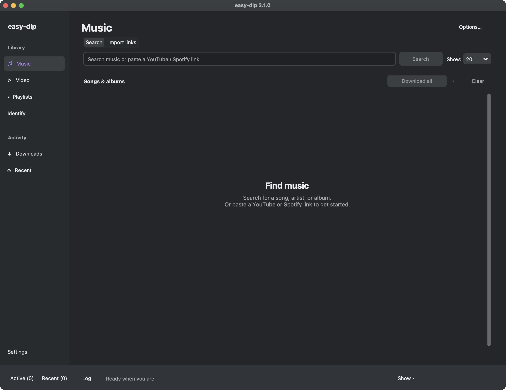

# easy-dlp

**Find music, preview it, and build a library you can keep.**

A Python desktop app by [Alex Lee](https://github.com/abl241) for searching YouTube, saving tagged music and videos, identifying songs, and discovering what to listen to next.

[Get started](#get-started) · [How to use it](#how-to-use-it) · [Engineering highlights](#engineering-highlights) · [Development](#development)



## What you can do

- **Save music with useful details.** Download MP3s with artist, album, cover art, and lyrics when available.
- **Search or paste a link.** Look up music and videos, or import YouTube and Spotify links to review a list of tracks.
- **Listen before downloading.** Play short previews, open the source in your browser, or choose a different YouTube match.
- **Identify a song.** Use an audio file or YouTube link. On macOS, you can also listen through your microphone or capture computer audio.
- **Explore your playlists.** Browse playlists from the macOS Music app or an exported playlist XML file, then find similar songs.
- **Save video and artwork.** Choose MP4 video, MP3 audio, JPG thumbnails, or a combination.

Spotify links supply track information; easy-dlp finds matching recordings on YouTube. It does not download audio from Spotify. Apple Music integration uses the Music app on your Mac; an Apple Music subscription is not required to save local MP3s.

## Get started

**One-time setup is required.** The included app icon is a launcher, not a self-contained installer. After installing the requirements, you can open the app by double-clicking.

### macOS

1. [Download the project ZIP](https://github.com/abl241/easy-dlp/archive/refs/heads/main.zip) and unzip it.
2. Install [Homebrew](https://brew.sh/) if you do not already have it. Open **Terminal** and paste:

   ```sh
   brew install python@3.12 python-tk@3.12 ffmpeg
   ```

3. Open the downloaded folder and double-click **easy-dlp.app** (Finder may show it as **easy-dlp**). If that does not open, try **Open easy-dlp.command**.
4. Wait for the first launch to install the app's supporting packages. Later launches reuse them.

Keep the app icon inside the project folder. For a convenient shortcut, double-click **Add easy-dlp to Desktop.command**.

<details>
<summary><strong>Windows setup</strong></summary>

1. Install **Python 3.10 or newer** from [python.org](https://www.python.org/downloads/windows/). Enable **Add python.exe to PATH** and keep **tcl/tk and IDLE** selected.
2. Install [FFmpeg](https://www.gyan.dev/ffmpeg/builds/). Extract the download and add its `bin` folder to your Windows **Path** environment variable. FFmpeg handles audio and video conversion.
3. [Download the project ZIP](https://github.com/abl241/easy-dlp/archive/refs/heads/main.zip), unzip it, and double-click **Open easy-dlp.bat**.
4. Wait for first-launch setup to finish.

The Music app integration and live microphone/computer-audio identification are macOS features. File and YouTube-link identification are available on other platforms.

</details>

<details>
<summary><strong>Linux setup (Ubuntu / Debian)</strong></summary>

Install the requirements:

```sh
sudo apt update
sudo apt install python3 python3-venv python3-tk ffmpeg
```

Download and unzip the project. Open a terminal in that folder and run:

```sh
chmod +x run.sh
./run.sh
```

Python 3.10 or newer is required. The launcher installs the remaining packages on first use.

</details>

### Your first download

1. Open **Music** in the sidebar.
2. Type a song or artist, or paste a YouTube link, then choose **Search**.
3. Use **▶** to hear a preview. Choose **Download** beside the recording you want.
4. Find the finished MP3 in your **Music** folder. Change save locations in **Settings**.

Use content you own or have permission to download.

## How to use it

### Music and imported playlists

The Music search box accepts searches, YouTube links, and Spotify links. For several links, choose **Import links**, paste one link per line from the same service, and choose **Import tracks**. Importing builds a review list; it does not immediately download everything.

For Spotify imports, use **Match on YouTube** when prompted, review the matches, and then download. Use **Change** in a track's controls to pick a different recording. **Download all** starts a batch; **Downloads**, **Recent**, and the bottom activity panel show its progress.

**Previews:** Music search and imported tracks normally play a short Apple catalog sample. To check the actual YouTube recording, right-click (Control-click on Mac) **▶** and choose **Play selected YouTube source**. Catalog samples may differ from the selected upload. Use **Open link** to listen in your browser.

**On Mac:** enable **Add to Apple Music** to import completed songs into the Music app. The optional **Apple Music only** setting deletes the output-folder MP3 after import; keep Music's **Copy files to Music Media folder when adding to library** enabled if you use it.

### Identify a song

Open **Identify**, choose an audio file or **YouTube link**, and select **Identify song**. When a song is recognized, choose **Find similar** to explore related tracks.

On macOS, choose **Microphone** or **Computer audio**, then **Listen**. Recording lasts up to 20 seconds; **Stop & identify** finishes early and **Cancel** discards it. Computer audio needs macOS 13 or newer. macOS may ask for recording permissions when you first use these features.

Temporary recordings are removed after recognition. Identification sends an audio fingerprint to Shazam through ShazamIO; it does not change your original file or its tags. Recognition and recommendations depend on an unofficial service and may not always return a result.

### Find music from your playlists

Open **Playlists** to browse playlists from the macOS Music app, or choose **Import playlist XML…** for an exported Music library/playlist file. Select a playlist, filter its tracks, and choose **Recommend for playlist**. Select a song to explore its related tracks instead.

Playlist recommendations combine suggestions from up to eight songs spread across the playlist, remove existing songs and duplicates, and show which tracks inspired each suggestion. They are based on that playlist, not your complete listening history. Reading playlists does not modify them.

Suggested songs offer previews and links. **Download…** takes you to Music to review a YouTube match before downloading the full recording. A disabled preview button means no catalog sample is available.

### Save videos

Open **Video**, search or paste a YouTube link, and choose your formats: **Audio (MP3)**, **Video (MP4)**, and/or **Thumbnail (JPG)**. Download an individual result or use **Download all**. Defaults save audio to **Music**, video to **Movies**, and thumbnails to **Pictures**; use **Output folders…** to change them.

## Need help?

- **The app will not open:** confirm Python includes tkinter and FFmpeg is installed. On macOS, use **Open easy-dlp.command** to see startup errors. In the project folder, `./run.sh --doctor` prints setup diagnostics.
- **Updating from an older version:** get the latest project files, then run `./run.sh --update` from the project folder on macOS/Linux. On Windows, run `.venv\Scripts\python.exe -m pip install --upgrade -r requirements.txt`. Restart the app afterward.
- **A song is the wrong version:** use **Change** to choose another YouTube match. Preview the selected source to check live, studio, or alternate recordings.
- **YouTube asks you to sign in:** Settings accepts an optional Netscape-format cookies file. Cookies contain login information; keep them private and never commit or share them.
- **Recording or Music access fails on Mac:** check **System Settings → Privacy & Security** for Microphone, Screen & System Audio Recording, or Automation access as appropriate. The launcher may appear as Python or Terminal. Restart after changing permissions.
- **No artwork, lyrics, preview, or recommendations:** availability varies by song and service. Missing metadata does not mean your downloaded audio is broken.

## Engineering highlights

Built by **Alex Lee**, easy-dlp brings desktop UI, media processing, external service integration, and background scheduling together in one application. The implementation emphasizes a responsive interface and explicit control over matching, downloading, and recording.

- **Responsive desktop UI:** CustomTkinter sidebar navigation retains page state; background jobs report progress through an event queue. Shared song tables, a collapsible activity panel, and paginated playlist views keep larger collections manageable.
- **Concurrent media pipeline:** bounded matching and download workers hand completed audio to a separate tagging pool. Output filenames stay reserved through tagging/import to avoid collisions. Cancellation, rate-limit backoff, and per-stage timing are part of the job lifecycle.
- **Metadata and matching:** artist, title, and duration comparisons help select catalog metadata and YouTube recordings. Mutagen writes ID3 tags and embedded artwork; cached catalog lookups reduce repeated requests.
- **Native macOS integration:** AppleScript connects to the Music library; AVFoundation and ScreenCaptureKit support explicitly started, time-limited audio capture. Temporary preview and recognition files are cleaned up after use.
- **Explainable recommendations:** playlist suggestions combine related-track results from sampled songs, exclude existing tracks, and retain source-song attribution. Local Music identifiers are kept separate from online catalog identifiers.
- **Regression coverage:** tests cover job scheduling, imports, matching/discovery, audio capture, previews, playlist artwork, and native UI behavior. Offline scheduling benchmarks separate concurrency improvements from real network performance.

**Stack:** Python 3.10+, CustomTkinter/Tk, yt-dlp, FFmpeg, Pillow, Mutagen, ShazamIO, SpotifyScraper, and macOS framework bindings.

See [pipeline design and benchmark methodology](docs/PERFORMANCE.md) and [UI architecture notes](docs/UI_OVERHAUL.md) for implementation details. More work by Alex: [GitHub profile](https://github.com/abl241).

## Development

```sh
git clone https://github.com/abl241/easy-dlp.git
cd easy-dlp
python3.12 -m venv .venv
source .venv/bin/activate
pip install -r requirements.txt
python main.py
```

On Windows, activate with `.venv\Scripts\activate`. Install FFmpeg separately. Using `requirements.txt` also installs the JavaScript runtime/helper packages used by yt-dlp.

Run the suite with a graphical desktop session (native UI tests create windows):

```sh
python -m unittest discover -s tests
```

Run the offline pipeline regressions and simulated scheduling benchmark:

```sh
python -m unittest discover -s tests -p 'test_*performance.py' -v
python scripts/benchmark_pipeline.py
```

Main code areas: `gui.py` and `ui.py` for the desktop shell; `jobs.py` and `downloader.py` for background work; `metadata/` for tagging; `discovery.py`, `recommendations.py`, and `playlists.py` for discovery; `capture.py` and `preview.py` for audio input/playback. These live under [`ytdlp_app/`](ytdlp_app/).

## Project status and license

Personal-use project under active development. macOS is the primary development environment; Windows and Linux launchers are included, but native Apple integrations are macOS-only. The app relies on third-party services whose availability can change.

Dependencies retain their own licenses: [yt-dlp](https://github.com/yt-dlp/yt-dlp/blob/master/LICENSE) uses the Unlicense; FFmpeg licensing depends on the build. See each dependency for its terms.
